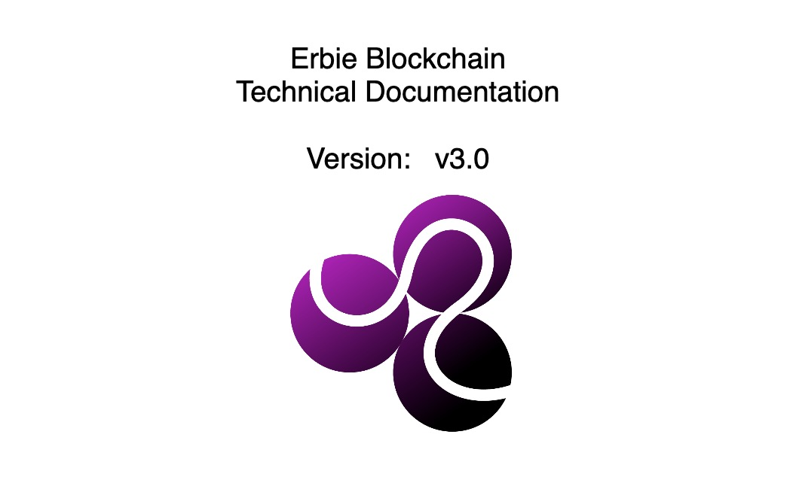

.. Erbie documentation master file, created by
   sphinx-quickstart on Mon Sep 19 16:08:29 2022.
   You can adapt this file completely to your liking, but it should at least
   contain the root `toctree` directive.

Content
======================

.. toctree::
   :caption: WELCOME TO ERBIE
   :titlesonly:

   preintro

.. toctree::
   :caption: GET STARTED ERBIE
   :titlesonly:

   technology/consensus/index
   technology/incentive/index
   technology/network/index
   technology/block/index
   

.. toctree::
   :caption: NON-FUNGIBLE TOKEN
   :titlesonly:

   snft/index
   snft/creator   

.. toctree::
   :caption: DEVELOPER RESOURCES
   :titlesonly:

   run
   Limino Wallet <https://www.erbie.io/docs/wallet/>
   Erbie SDK <https://github.com/erbieio/erb-client>
   erbiedata

.. toctree::
   :caption: UPGRADE
   :titlesonly:

.. toctree::
   :caption: APPENDIX
   :titlesonly:

   appendix/index
   appendix/history
   