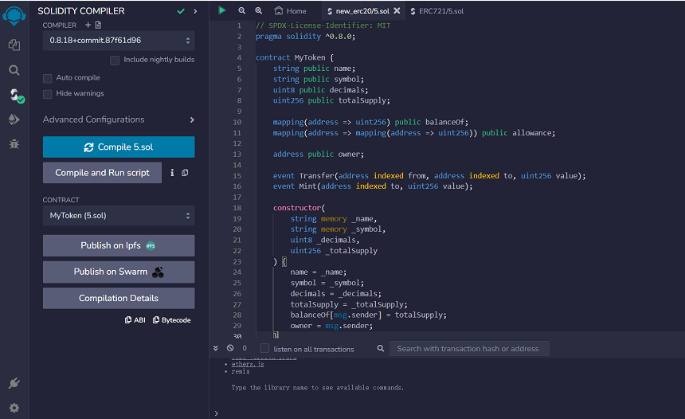
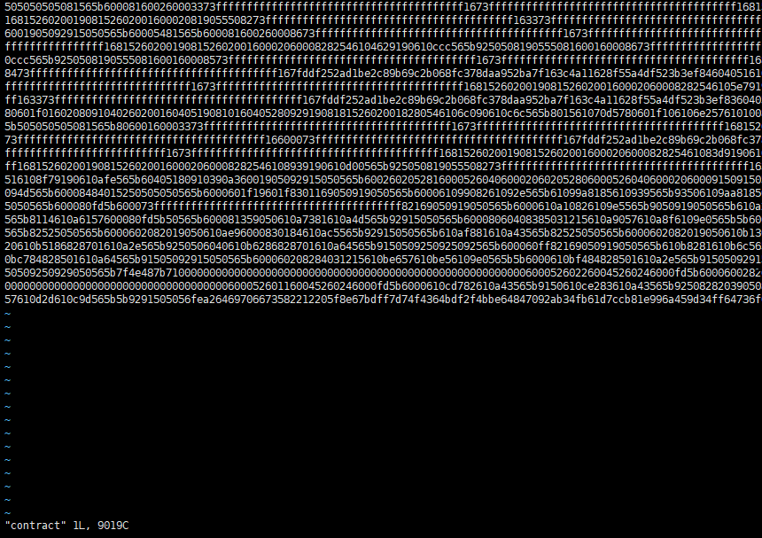
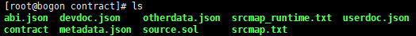

Smart Contract Deployment Guide
=================================

This chapter introduces how to publish your Token/NFT products or fungible tokens on the erbie main net. Before reading this chapter, please familiarize yourself with information about the Solidity language, the ERC20/ERC721 contract standard. You need to use the Remix tool to compile the contract source code. Make sure you have the contract's source code ready to compile and deploy.

Illustrate
----------------

To deploy a contract, please strictly adhere to the Ethereum ERC20/ERC721 contract standards. The types and methods defined in the contract should be named according to the standard.

  - **CAUTION**
  - erbie blockchain browser currently does not support parsing custom parameter types and function methods.

The reference code is as follows:

- `ERC20 <https://ethereum.org/en/developers/docs/standards/tokens/erc-20/>`_

**Methods**

.. code-block:: go

    function name() public view returns (string)
    function symbol() public view returns (string)
    function decimals() public view returns (uint8)
    function totalSupply() public view returns (uint256)
    function balanceOf(address _owner) public view returns (uint256 balance)
    function transfer(address _to, uint256 _value) public returns (bool success)
    function transferFrom(address _from, address _to, uint256 _value) public returns (bool success)
    function approve(address _spender, uint256 _value) public returns (bool success)
    function allowance(address _owner, address _spender) public view returns (uint256 remaining)

**Events**

.. code-block:: go

    event Transfer(address indexed _from, address indexed _to, uint256 _value)
    event Approval(address indexed _owner, address indexed _spender, uint256 _value)

- `ERC721 <https://ethereum.org/en/developers/docs/standards/tokens/erc-721/>`_

**Methods**

.. code-block:: go

    function balanceOf(address _owner) external view returns (uint256);
    function ownerOf(uint256 _tokenId) external view returns (address);
    function safeTransferFrom(address _from, address _to, uint256 _tokenId, bytes data) external payable;
    function safeTransferFrom(address _from, address _to, uint256 _tokenId) external payable;
    function transferFrom(address _from, address _to, uint256 _tokenId) external payable;
    function approve(address _approved, uint256 _tokenId) external payable;
    function setApprovalForAll(address _operator, bool _approved) external;
    function getApproved(uint256 _tokenId) external view returns (address);
    function isApprovedForAll(address _owner, address _operator) external view returns (bool);

**Events**

.. code-block:: go

    event Transfer(address indexed _from, address indexed _to, uint256 indexed _tokenId);
    event Approval(address indexed _owner, address indexed _approved, uint256 indexed _tokenId);
    event ApprovalForAll(address indexed _owner, address indexed _operator, bool _approved);

Contract deployment
------------------------

What is required before deploy contracts?
~~~~~~~~~~~~~~~~~~~~~~~~~~~~~~~~~~~~~~~~~~~~~~

  - A tradable and running Validator
  - An account with a certain amount of TTOS coins to pay the gas fees generated during the deployment process.
  - The binary code of the contract which is Bytecode or Calldata in Remix IDE
  - A string of hexadecimal digits (as shown in the following figure).

  - Start erbie validator node,generated contract folder in current directory of the program.Placed the binary code generated from the contract into the contract file in the directory.

Example: The content of the contract file is similar to the following figure.

Contract Deployment
~~~~~~~~~~~~~~~~~~~~~~~~~

1. Run the following command to run the node in menu mode

.. code-block:: go

    ./tfs_v0.32.x_xxxx_testnet - m

2. Validator node running Menu Options 8. Deploy Contract

3. Select the type of virtual machine running the contract.

4. According to the prompts, enter the contract name, version and compliant standards in sequence.The contract binary code, source code, ABI, and other information need to be saved in the form of a text file on the host.
Please be aware of the following information before proceeding:

    i. To read the information column of a file type, you need to enter the file path or use default rules to read it.
    ii. In advance, place the binary source code in the contract file. You can read the information from the file directly by selecting option 0. If the contract file does not exist, skip the contract reading operation.

    iii. The default reading rules for files are as follows:
    **Contract source codes:** ./contract/source.sol
    **ABI:** ./contract/abi.json
    **User Documentation:** ./contract/userdoc.json
    **Operation Documentation:** ./contract/devdoc.json
    **Compilation options:** ./contract/compiler_options.json
    **Source code compilation bytecode mapping:** ./contract/srcmap.txt
    **Bytecode mapping during source code runtime:** srcmap_runtime.txt
    **Metadata:** ./contract/metadata.json
    **Custom Data:** ./contract/otherdata.json
    **Contract Bytecode:** ./contract/contract
5. If the contract constructor has passed-in parameters, you need to enter the Parameters binary code required for deployment (if the binary code stored in the contract file is Calldata, skip directly). Otherwise,enter 0 to skip.

Contract Execution
----------------------------------

What is required before Execute contracts?
~~~~~~~~~~~~~~~~~~~~~~~~~~~~~~~~~~~~~~~~~~~~~~

  - The deployer's wallet address
  - The transaction hash generated by the deployment contract

Contract Execution
~~~~~~~~~~~~~~~~~~~~~~~~~~

  1. Validator node running Menu options 9. Call contract
  2. Enter the wallet address of the contract deployer, which is the wallet address of the deployment contract node.
  3. Enter the transaction hash when running contract deployment.
  4. Enter the input args to run the contract.
  5. Enter the tip to be paid to the contract deployment address. 0 can be entered, but if the Tip is not 0, the tip must not be less than the gas fee.
  6. Enter the fees to be paid to the contract.0 can be entered.

  - **TIPS:**

    **Pay attention to unit conversion** If the balance is displayed as 999.92064300, that is 99,992,064,300 contract transfer units. If you want to pay contract 100TTOS, enter 10,000,000,000; If 100 is entered, the actual payment will be made to the contract 0.000001TTOS.