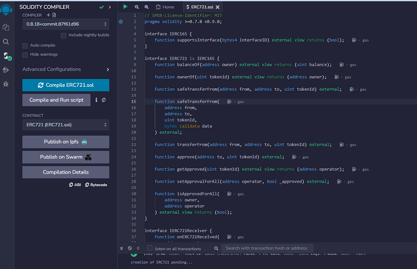
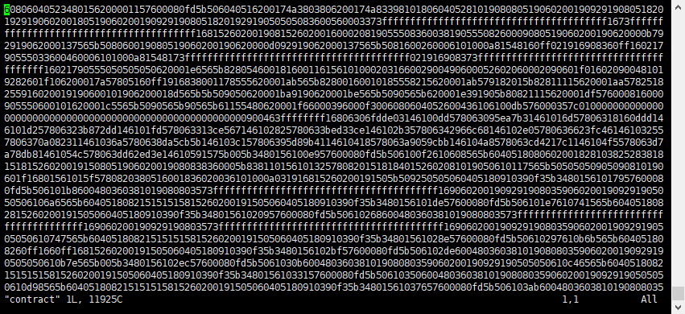
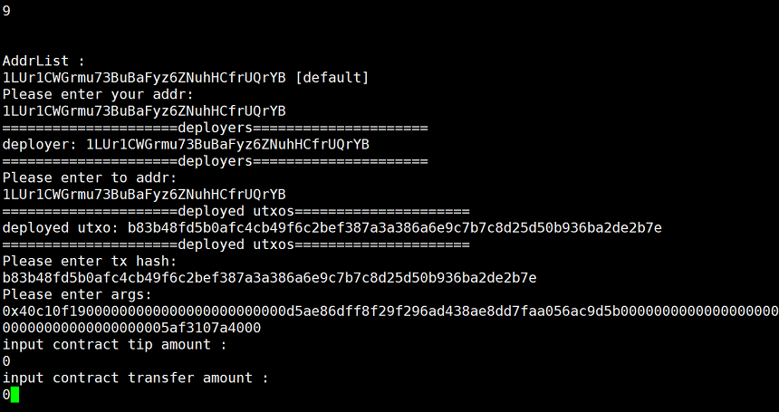

ERC721 contract deployment Example
========================================

Preparation
---------------

1. Write your ERC721 contract source code
2. Open the compilation contract tool: `Remix <https://remix.ethereum.org>`_
3. Prepare your node server and successfully deploy the transformers program.

We take the `ERC-721 <https://solidity-by-example.org/app/erc721/>`_ from solidity by example as a demonstration.

Contract Deployment
-------------------------

1. Use Remix to compile the contract source code.Open the Remix tool. Paste your ERC721 contract source code into Remix and compile it.

2. The most important thing to execute a contract in transformers is to get the input bytecode, which indicates which interface you need to implement in the contract and what parameters need to be passed.

3. Obtain contract Bytecode and ABI,After Remix is successfully compiled, get the generated contract bytecode (Contract bytecode) and ABI. This information will be used in the subsequent deployment and execution of the contract.

4. Create a deployment preparation file,When the transformers node program is started, a folder named contract will be generated in the same directory as the program. Go into the contract folder and create a file called contract.txt to store the compiled bytecode of the contract.

5. Write the contract bytecode to the file,Copy and paste the contract bytecode obtained in Remix into the contract.txt file.After saving and exiting.

6. Start the transformers program,Restart the transformers node program in the menu bar.

.. code-block:: go

 ./tfs_v0.32.0_xxxx_testnet -m

7. In the transformers node program, choose to execute 8. Deploy contract operation. The address displayed by default is the wallet address of the deployer.

Fill in the relevant information as prompted. If the initial input is a contract bytecode without parameters, fill in the parameter bytecode; otherwise fill in 0.

8. **Deployment complete**

After the contract is successfully deployed, you will get the deployment address of the contract and the hash of the deployed contract.

Contract Execution
--------------------

To execute a contract, you first need to be familiar with the internal parameters and methods of the contract. The following example uses the mint function as an example to call the contract to complete NFT casting.

1. In the transformers node program, choose to perform the 9. Call contract operation.

2. Fill in the relevant information for executing the contract according to the interface and parameters of the contract, and complete the steps of executing the contract.

[Please enter args] with the **bytecode** of the execution method filled in.

After completing the content one by one, the contract was successfully executed and a mint operation was completed.