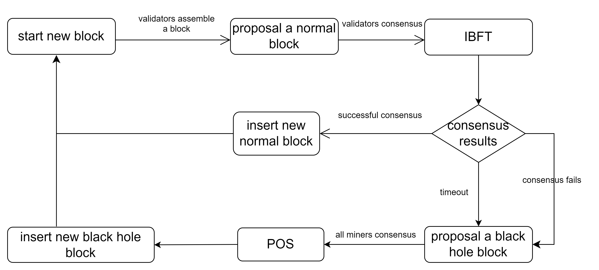

Consensus Process
==================
ErbieChain has combined WPoS and BFT to ensure consensus efficiency while also ensuring that all staked nodes have the opportunity to participate in block generation and consensus. In addition, to prevent participants from submitting multiple blocks or committing fraud on multiple blocks, ErbieChain has also optimized the BFT algorithm so that consensus nodes can only issue one commit message with their own signature at a time.

The consensus process of ErbieChain
~~~~~~~~~~~~~~~~~~~~~~~~~~~~~~~~~~~~~~~~~~~~~~

The consensus process of ErbieChain involves using BFT algorithm for ordinary blocks based on Dynamic Random Election (DRE) and WPoS consensus algorithm for blackhole blocks based on DRE.

There are two types of blocks produced in the ErbieChain, ordinary blocks and blackhole blocks. In order to participate in block production or block consensus, users must stake the ERB digital currency on the ErbieChain and become a miner, with their account address being stored in a miner list sorted by staking amount.

The overall consensus process for ErbieChain is shown in the diagram below:

Firstly, the ErbieChain uses a combination of DRE and BFT algorithms for producing ordinary blocks.

When a new block needs to be produced, the DRE algorithm randomly selects 11 validator nodes from the miner list based on their staking amount. These validator nodes are sorted based on their online weight value, and nodes decide whether to participate in the production or consensus of the ordinary block based on whether they are one of the 11 validators. The BFT algorithm is used for consensus among the 11 validator nodes. Additionally, the block proposer will increase the online weight value of nodes based on the received consensus messages.

To adapt to ErbieChain’s requirements, the BFT algorithm has been adjusted, where if a validator has already submitted a commit message, they will not participate in voting for subsequent rounds.

The process flowchart for producing ordinary blocks is shown below: 

Ordinary Block
~~~~~~~~~~~~~~~~~
The ErbieChain uses the DRE+BFT combined consensus algorithm to produce ordinary blocks.

When a new block needs to be produced, the miner node will first randomly select 11 miner addresses from the miner list as Validators based on the DRE algorithm, and sort these 11 Validators according to their respective online weight values. The node will decide whether to produce an ordinary block or participate in the consensus of the ordinary block based on whether it is one of these 11 Validators. The process of generating a new block uses the BFT algorithm. In addition, the block-producing node will increase the online weight value of the corresponding node based on the received consensus message.

To meet the requirements of ErbieChain, we have made adjustments to the BFT algorithm, that is, if a Validator has already submitted a commit message, it will not vote for subsequent rounds.

The following is a flowchart of the process of producing ordinary blocks:

Blackhole Block
~~~~~~~~~~~~~~~~~~~~~~~~

When the online rate of miner nodes is low and 5 or more Validators are not online among the randomly selected 11 Validators, the fault tolerance of the BFT algorithm is exceeded, which will cause the blockchain system to shut down and unable to produce new blocks. Therefore, we have introduced the DRE+WPoS combined consensus algorithm. The miner node will choose to produce a blackhole block and insert it into the ErbieChain standard chain to solve the downtime risk of the BFT algorithm when applied to the public chain.

- After successfully producing a blackhole block, the block proposer will first reduce the weight value of the 11 Validators who should have produced ordinary blocks at the same height, and then increase the online weight value of the corresponding node based on the received consensus message of the blackhole block.

- The blackhole block will not distribute any rewards, which avoids the situation where large staked miner nodes try to produce blackhole blocks to obtain more rewards instead of verifying ordinary blocks, thus preventing the production of ordinary blocks. The ErbieChain follows the principle of "prioritizing the production of ordinary blocks". When it is unable to produce ordinary blocks smoothly, it will choose to produce blackhole blocks. This avoids the situation of "the rich get richer".

The following is the process of producing blackhole blocks:

.. image:: blackholeblock.png

