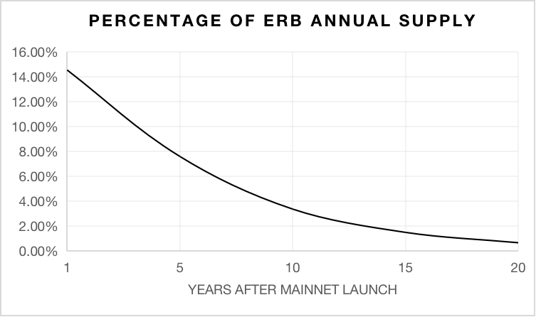
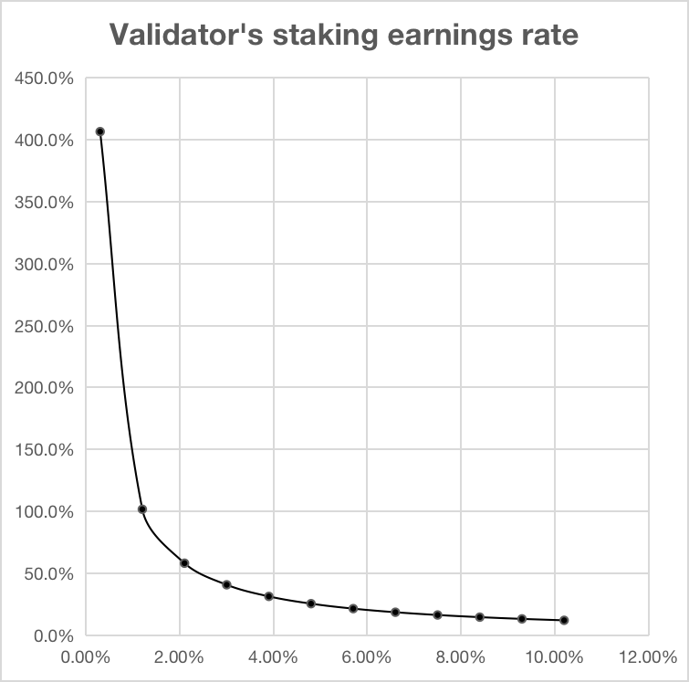

Circulation
============================================================

- Circulation refers to the number of crypto assets minted by the protocol to incentivize its participants.
- With each block produced, a specific number of ERBs are generated, which is reduced by a certain percentage each year.

Rewards Derived from Circulation
~~~~~~~~~~~~~~~~~~~~~~~~~~~~~~~~~~~~~~~~~~~~~~~~
The circulating supply is the quantity of ERBs minted by the protocol to incentivize its participants. Taking into account actions such as burning transaction fees, the net increase in supply is sometimes referred to as inflation or supply growth. After each successful creation of standard blocks, seven validators are randomly selected to receive 0.16 ERBs each, and four are randomly chosen to receive one SNFT L0 each from the SNFT staking list.

Primary Incentives for Each Increment
~~~~~~~~~~~~~~~~~~~~~~~~~~~~~~~~~~~~~~~~~~~~~~~~
Incentives for mining (rewards in ERBs for Validators successfully participating in the consensus, and SNFT incentives for Stakers that are proportionally converted to ERBs) are tied to ErbieChain's inflation curve. This curve starts with 300M ERBs at the genesis block. In the first year, approximately 43.64M ERBs are mined (this number is an estimate as the behavior of users in exchanging assets is unpredictable). In each subsequent year, due to a reduction in mining rewards and a decline in the SNFT exchange rate (15% per year), the yield of ERB will increasingly diminish. After about 20 years from the creation of the network, a total of approximately 279.69M ERBs will have been mined.

As a result, the total supply in years after start-up is as follows:

====================      ===================
Years After Start-up        Total Supply      
====================      ===================
0                           300M
0-1                         343.64M
1-2                         380.74M
2-3                         412.28M
====================      ===================

The inflation chart below shows the annual percentage of supply increase due to inflation.

Total Circulation
~~~~~~~~~~~~~~~~~~~~~~~~~~~~~~~~~~~~~~~~~~~~~~~~

Under the ideal conditions we assume, the ErbieChain protocol is designed to have a maximum total supply of 579.69M over 20 years.

.. image:: total_amount_l1.png

Validator's Reward
~~~~~~~~~~~~~~~~~~~~~~~~~~~~~~~~~~~~~~~~~~~~~~~~

Similarly to the supply calculation, we can calculate the expected annual percentage reward for a validator's participation in the ErbieChain protocol.

Given the unique nature of the ErbieChain DRE algorithm, a consensus requires the participation of 11 validators. Using this number as a baseline, assuming a full net staking rate, and considering a certain increase in linear indices, we can generate the following data table.

===========   ==========================================   ===================================================
Stake Rate     Number of Stakers (pre-estimated)            Annual rate of Rateeturn (pre-estimated)                                               
===========   ==========================================   ===================================================
0.30%	            11 	                                        406.7%
1.20%	            99 	                                        101.7%
2.10%	            174 	                                    58.1%
3.00%	            248 	                                    40.7%
3.90%	            323 	                                    31.3%
4.80%	            397 	                                    25.4%
5.70%	            471 	                                    21.4%
6.60%	            546 	                                    18.5%
7.50%	            620 	                                    16.3%
8.40%	            695 	                                    14.5%
9.30%	            769 	                                    13.1%
10.20%	            844 	                                    12.0%
===========   ==========================================   ===================================================

The curves drawn from the above table are as follows:

