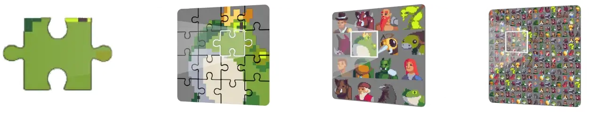

SNFT Overview
=========================

ErbieChain possesses two native assets - the fungible token ERB and the non-fungible token SNFT.

SNFT is akin to the traditional NFT concept based on the smart contract layer, but it differentiates itself as a native non-replaceable asset on ErbieChain. SNFT minting is completed automatically by ErbieChain, dividing into 16 equal segments each with a unique identifier minted on the chain. During each ordinary block creation, 4 Stakers are randomly selected to distribute 1 SNFT fragment as a direct reward. The ErbieChain's direct incorporation of the 721 standard relating to NFT grants it immediate NFT-related functionalities.

SNFT has four levels - L0, L1, L2, and L3, with L0 being the lowest and L3 the highest. SNFT comes with an automatic synthesis feature with the following synthesis rules: 16 specific L0 SNFTs can merge into a unique L1 SNFT, 16 specific L1 SNFTs into a unique L2 SNFT, and 16 specific L2 SNFTs into a unique L3 SNFT.

SNFT and NFT
-----------------------------------------------------------------------------------------------

NFT, as a reliable and non-fungible encrypted asset on the chain, is well-suited for cross-chain value interaction. However, capitalizing on these unique features to create value remains a challenge. The evident liquidity problem in the NFT field means that its value is largely tethered to speculation and the corresponding token value. Market frenzies and NFT price bubbles result in sharp declines when these bubbles burst.

SNFT, one of the two primary assets on ErbieChain, stands out with its unique fragmentation property and its ability to exchange ERB at varying rates according to SNFT levels, supporting the value of SNFT and creating liquidity for SNFT. 

SNFT Logic Foundation
-------------------------------------------------------------------------------------------

- Election Logic: All ChainLayer NFTs have the potential to be randomly elected as SNFTs, with mining performed by stakers.
  For instance, if User A creates ChainLayer NFT B, and ChainLayer NFT B is chosen as the new L3 SNFT, User A becomes the creator of the new L3 SNFT. ChainLayer NFT B will be automatically fragmented into 4096 L0 SNFT parts, as block rewards for distribution among stakers.

- Generation: 30% of the mainnet assets are awarded as inflation rewards to validators involved in establishing the mainnet networks' infrastructure and stakers who stake ERB on-chain.
  Each block reward portion of 4/11 (SNFT L0) is distributed among stakers, and 7/11 (0.16 ERB) among validators.

- Circulation: SNFT, like the homogeneous token ERB, circulates on the ErbieChain blockchain. As a non-fungible form of token, SNFT embodies all the fundamental attributes of traditional NFTs and can be traded directly or swapped for ERB at different rates based on the SNFT level. ERB can be traded in any digital wallet that supports EVM, but SNFT is currently only supported by the Limino wallet. When the synthesis requirements are met, the SNFT stored in the digital wallet will be automatically upgraded to a higher-level SNFT.

SNFT Incentive and Exchange Model
--------------------------------------------------

**Incentive Model**

Every block in ErbieChain produces 4 L0 SNFT fragments, accounting for 4/11 of the block reward. The allocation to stakers is weighted according to the quantity of ERB staked (with a minimum requirement of 700 ERB). Each staking address has a corresponding weight and sphere of influence, which expand as the number of staked tokens increases.

For each block, the top four stakers are selected, based on the extent to which their influence encompasses the SNFT reward drop range of the given block. This selection process is influenced by the validators' participation in the DRE consensus mechanism. The unpredictable nature of the selection process means that if the chosen position lies outside of their influence range, stakers are unable to participate in the block rewards. A fixed number of SNFTs (four) are assigned per block and are evenly distributed among the four selected stakers. This mechanism ensures relative fairness and prevents the monopolization of the SNFT incentive distribution system.

**Exchange Model**

Exchange Equity: The ErbieChain blockchain incorporates an SNFT incremental model, in which SNFT holders are given an enhanced exchange rate for trading ERB. SNFT exists at four levels: L0, L1, L2, and L3, with L0 being an SNFT fragment.

Every set of 16 lower-level SNFTs can be combined to form one higher-level SNFT. At the L0 stage, the exchange price for each SNFT fragment is 0.03 ERB. Synthesizing an L1 SNFT increases the price per fragment to 0.06 ERB. For an L2 SNFT, the price per fragment rises to 0.18 ERB, and for an L3 SNFT, it reaches 1.00 ERB.

.. csv-table:: 
    :header: "SNFT Level", "Exchange Rate（ERB）", "SNFT Number（Max）","Exchange Amount（ERB）","Exchange Increment"

    "L0", 0.03, 1,    0.03,     0%
    "L1",	0.06,	16,	  0.96,	    100%
    "L2",	0.18,	256,	46.08,	  500%
    "L3",	1.00,	4096,	4096.00,	3233%

.. note:: The calculation formula for the exchange amount is as follows: Exchange Amount = Exchange Rate x SNFT Number. The table above illustrates the increase in the exchange rate, which is calculated in comparison to the L0 level.

The Value of SNFT
------------------------------

The value of SNFT can be segmented into four categories:

1. Trading Value: Like conventional NFTs, SNFTs can be freely traded on both primary and secondary markets.
2. Exchange Value: The ErbieChain blockchain integrates an SNFT incremental model, allowing SNFT holders to exchange their tokens for ERB using the Limino wallet.
3. Collection and Resale Value: Collectors can keep desired SNFTs and trade unwanted ones on SNFT exchanges, establishing a secondary market with ready liquidity for SNFTs.
4. Community Participation Value: Encourages active community involvement in the growth and safeguarding of ErbieChain's blockchain assets. Annually, Stakers receive a total of 25.2288M SNFTs as incentives for staking and protecting the ErbieChain blockchain network.

