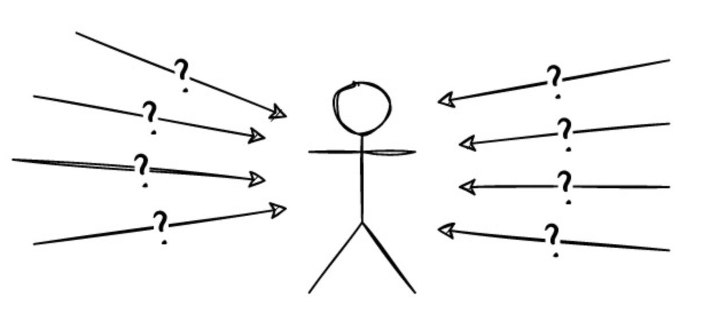

Byzantine Fault-Tolerant (BFT)
============================================

The Byzantine algorithm is an algorithm used to solve the trust issues that may exist between nodes in distributed systems. It can ensure that under certain conditions, even if some nodes fail or behave maliciously, the nodes can still reach consensus. In this paper, we will explore in depth the background, principles and applications of the Byzantine algorithm.

Background
~~~~~~~~~~~~~~~~~~~~~~~~~~~~~~~~~~~~~~
In distributed systems, due to the unreliability of each node and the instability of the network, it is often impossible to reach consensus. The Byzantine problem refers to the problem in distributed systems, where nodes cannot reach a consensus due to the failure or malintent of some nodes.The problem was first proposed by Leslie Lamport and others in a 1982 paper called the "Byzantine Generals Problem," which describes the basic problem consensus systems seek to solve: constructing reliable distributed systems.

Byzantine Generals Problem
~~~~~~~~~~~~~~~~~~~~~~~~~~~~~~~~~~~~~~

    We imagine the several legions of the Byzantine army camped outside the enemy city, each legion commanded by its own general. The generals can only communicate with each other through messengers. After observing the enemy, they must agree on a common action plan.

This allegory clearly shows that without an overall view - without a god mode - we cannot see the whole situation and make a decision at a glance. We are only one of the generals, and our only source of information about the other generals is the messages we receive - possibly correct messages, or lies, or misunderstandings based on limited information, or messages delayed or modified during transport. We have only very limited local views, but we must have a definite result for the state of the entire system.

When we draw the charts for blockchains and block trees, it's easy to assume that this is some kind of 'state' of the entire system. But these diagrams can only represent the local view of a single participant in the system. Because we are running on an unreliable network, my node's view of the system may differ from yours, even temporarily. For example, you will see blocks with different timestamps or different orders than I do, or even blocks that I don't see.

    Some generals may be traitors, attempting to prevent the faithful generals from reaching an agreement.

These treacherous generals exhibit what we call Byzantine behavior or Byzantine errors. They can act in any arbitrary way: delaying messages, reordering messages, telling outright lies, sending contradictory messages to different recipients, not answering at all, or anything else we can think of. The Byzantine Generals Problem is an algorithmic challenge to create a system which can still achieve consensus despite these kinds of malicious or unreliable actors. 

I am receiving a large amount of information from other nodes, but I do not know which information is accurate, the order in which they are sent, or if any messages have been lost or simply delayed. Therefore, we need to establish some kind of protocol.

The core idea
~~~~~~~~~~~~~~~~~~~~~~~~~~~~~~~~~~~~~~

The core idea of the Byzantine fault-tolerant (BFT) algorithm is to solve the trust problem between nodes through fault-tolerant mechanisms, that is, by introducing enough fault-tolerant mechanisms in the algorithm to ensure its correctness.

In the BFT algorithm, each node can be a general, and nodes exchange information through message passing to reach a consensus on one issue. Therefore, loyal generals need a reliable rule to provide a result under the following conditions:

    Consistency: 1.All loyal generals make the same action plan decision [e.g., “attack” or “retreat”].2.A few traitors cannot make loyal generals adopt a bad plan.

Solutions
~~~~~~~~~~~~~~~~~~~~~~~~~~~~~~~~~~~~~~
Reaching a consensus in such a Byzantine distributed system is not an easy problem to solve, but there have been several successful methods over the years.

The first mainstream solution is the practical Byzantine fault-tolerant (PBFT) algorithm published by Liskov and Castro in 1999. This relies on a relatively small and limited set of known consensus participants (called replicas). PBFT is always secure, and in the terminology discussed below, it has no fork.

In 2008, Satoshi Nakamoto invented the “Nakamoto consensus” for Bitcoin using a completely different approach. Instead of limiting participants to a known set, it uses proof of work to select a temporary leader for consensus without requiring permission. Unlike PBFT, Nakamoto consensus allows forks and is technically not secure.

Many variations of these protocols and other novel alternatives, such as the Avalanche protocol family, have since emerged.

Existing BFT algorithms have many advantages, such as high transaction throughput, low resource consumption, and ease of understanding. Therefore, adopting BFT algorithms in blockchain systems can greatly improve the TPS of blockchain systems. However, BFT algorithms also have significant disadvantages, such as the number of nodes seriously affecting the efficiency of the algorithm. As the number of nodes increases, the performance will exponentially decrease, and the scalability of nodes is poor. Therefore, it is not suitable for blockchain systems with a large number of nodes. In addition, the BFT algorithm requires that the number of malicious nodes cannot exceed 1/3 of the total number of nodes, which means that the fault tolerance of the BFT algorithm is relatively low, and using this algorithm in public chains is prone to downtime risks.

ErbieChain uses a combination of WPoS+BFT to address the above issues. 

1. Nodes need to stake ERB in order to participate in block consensus.
2. At each block time, 11 Validators are chosen from the staking list and use the BFT algorithm to reach consensus on the block.

This not only ensures consensus efficiency, but also ensures that all staking nodes have the opportunity to participate in block generation and consensus.

    Additionally, to prevent participants from submitting multiple blocks or signing multiple blocks for malicious purposes, ErbieChain has also optimized the BFT algorithm, whereby consensus nodes can only send out a single commit message with their own signature.

----

.. [#f1] Some of the content in this document is quoted from `Ethereum <https://eth2book.info/capella/part2/consensus/preliminaries/>`_ .