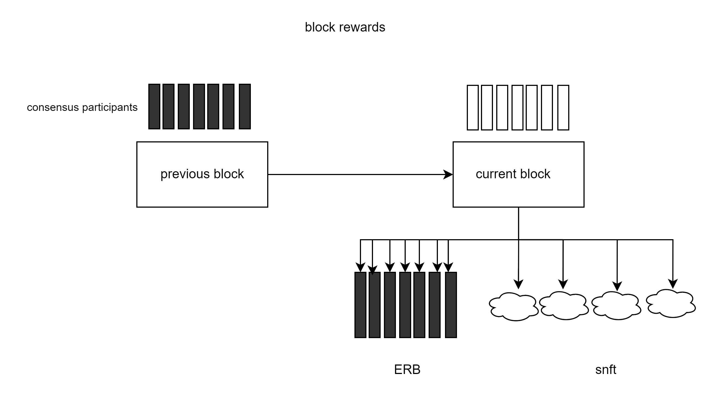

Incentive Mechanisms
======================================

As mentioned above, the ErbieChain protocol consists of two different types of blocks: ordinary blocks and empty blocks. Only ordinary blocks generate rewards; empty blocks do not yield any rewards.

According to the economic model design, normal blocks create two types of rewards, ERB and SNFT L0. The ERB for the current block is distributed to the validators of the previous block, while the SNFT reward is distributed to the current block's stakers. The following diagram provides a brief explanation:

Incentive Allocation
~~~~~~~~~~~~~~~~~~~~~~~~~~~~~~~~~~

- ERB: Each block distributes incentives to 7 Validators, allocating 0.16 ERBs to each rewarded validator. The deflation rate decreases by 15% per year.
- SNFT: Each block distributes an incentive to 4 Stakers, each rewarded Staker receives one SNFT L0.

Other Rewards: Users engaged in various activities within ErbieChain's ecosystem or contributing to ErbieChain have the opportunity to receive incentives such as ERB, SNFT, etc.

